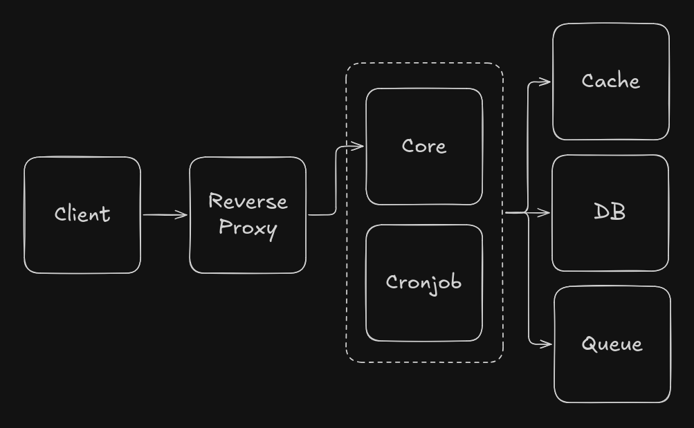

# Architecture and System Design Document

### Overview
This document describes the architecture and system design of an SMS Gateway developed for ArvanCloud technical challenge. The system is designed to serve +10,000 businesses while processing up to 100 million SMS messages per day. some clients generate a very high volume of SMS requests, while others send messages at low rates. The platform must provide reports and analytics and also it must support Express messages.

### System Requirements

This service must satisfy the following requirements:

- Support +10,000 client accounts
- Process 100 million SMS requests per day
- Provide clients with access to reporting and analytics
- Clients with high SMS submission rates
- Support Express SMS messages

From a hardware perspective, this system is highly I/O-intensive and storing large volumes of SMS data requires significant disk capacity. In contrast, the workload is expected to place relatively low pressure on CPU and memory resources. This allows the architecture to prioritize network and disk, over CPU and RAM.

we can estimate the expected workload and storage requirements:

- 100 million RPD = 1,157 RPS on average
- Assuming 5× traffic at peak times, the system should be capable of handling 6,000 RPS.
- Assume each SMS record is 180 bytes of storage
- Storing 100 million SMS records requires approximately 18 GB of storage per day
- Including other overheads, the system is expected to require 10 TB of storage per year.

### High-Level Architecture

Based on the system requirements, we can now design a high-level architecture:

- A reverse proxy such as NGINX or HAProxy distributes requests across multiple core instances. this layer can be horizontally scaled using multiple instances by DNS-based load balancing.
- The Core Service have a REST API and runs workers in parallel to process background jobs. It supports both vertical scaling by utilizing available hardware resources and horizontal scaling through its stateless architecture.
- An ACID-compliant database is used to store and track SMS records. Table partitioning, sharding, and replication are used to scale write and read IO, allowing the database to grow horizontally across multiple instances.
- A cache layer, such as Redis, reduces database load by serving data from memory. For read-heavy scenarios, multiple read replicas can be deployed to improve scalability.
- A message queue, such as RabbitMQ, is used to process high volumes of SMS requests asynchronously and manage SMS status updates. Multiple workers can consume messages from the queue, and the system can be scaled horizontally.

This architecture provides:

- High availability with eventual consistency
- Verical and horizontal scaling available for each component
- Maximum performance

### Network Optimizations

- Use HTTP/2 and Keep-Alive headers for persistent connections in reverse proxy
- TLS Session Caching in reverse proxy
- Data compression in core
- Data caching in core and cronjob
- TCP connection pools in core and cronjob
- DNS Load balancing for reverse proxy
- HTTP/TCP Load balancing for core and cache/db/queue
- Async workloads

### Disk Optimizations

- Batch IO everywhere possible
- Schema optimization (proper data types and paddings)
- B+Tree index on time-based UUIDs (Snowflake algorithm)
- Table partitioning
- Sharding
- Replication (Don't need another column based db like clickhouse)
- RAID and higher IOPS disks

### RAM Optimizations

- Compiled language with low runtime overhead (golang)
- Avoid copy valus as mush as possible and use references
- Table partitioning allow small B+Trees that fits in DB buffer
- Snowflake UUID avoids B+Tree index map shrinking

### CPU Optimizations

- Async workloads
- Efficiently use of CPU cores for maximum parallelism (goroutines)
- Lock-free algorithms (Avoiding mutex)

### Todos

- Outbox pattern
- Maybe better use of CPU cache
- Use seperate queues for express sms